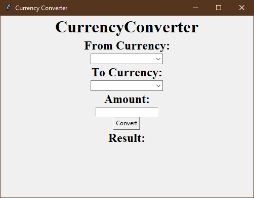

# CurrencyConverter Python Project

CurrencyConverter is a Python project that leverages the powerful CurrencyConverter package to provide real-time currency conversion capabilities. Say goodbye to manual currency calculations and complicated exchange rate lookups; with CurrencyConverter, you can effortlessly convert between various currencies with ease.



---

## Table of Contents

- [About the Project](#about-the-project)
  - [Built With](#built-with)
- [Getting Started](#getting-started)
  - [Prerequisites](#prerequisites)
  - [Installation](#installation)
- [Usage](#usage)
- [Features](#features)
- [Contributing](#contributing)
- [Acknowledgements](#acknowledgements)

---

## About the Project

Currency conversion can be a complex and time-consuming task, especially when dealing with multiple currencies. The CurrencyConverter Python project simplifies this process by utilizing the CurrencyConverter package to provide real-time exchange rate information and perform currency conversions with ease. Whether you're a traveler, an e-commerce business, or a financial professional, CurrencyConverter makes currency conversion a breeze.

### Built With

- Python
- CurrencyConverter Package (https://pypi.org/project/CurrencyConverter/)

---

## Getting Started

To get started with the CurrencyConverter Python project, follow these steps:

### Prerequisites

Before you begin, ensure you have the following software and packages installed:

- Python 3.x
- CurrencyConverter Package (installed via pip)

### Installation

1. Clone the repository:

   ```sh
   git clone https://github.com/prathmeshboratae/CurrencyConverter.git

2. Navigate to the project directory:

   ```sh
   cd CurrencyConverter

3. Install the required Python packages:

   ```sh
   pip install CurrencyConverter
   pip install tkinter

4. Run the CurrencyConverter:

   ```sh
   python main.py

## Usage
1. Run the CurrencyConverter application.
2. Enter the amount you want to convert and select the source currency.
3. Choose the target currency.
4. Click "Convert."
5. The converted amount will be displayed.

## Features
- Real-time currency conversion using the CurrencyConverter package.
- Support for a wide range of currencies.
- User-friendly command-line interface.
- Customizable and extensible for integration into other applications.

## Contributing
Contributions to the CurrencyConverter project are welcome! To contribute:

1. Fork the project.
2. Create your feature branch (`git checkout -b feature/your-feature`).
3. Commit your changes (`git commit -m 'Add some feature`).
4. Push to the branch (`git push origin feature/your-feature`).
5. Open a pull request.

## Acknowledgements
- The CurrencyConverter Python project utilizes the CurrencyConverter package, which is made possible by the open-source community.
- Special thanks to the developers of the CurrencyConverter package for providing a valuable tool for currency conversion.
